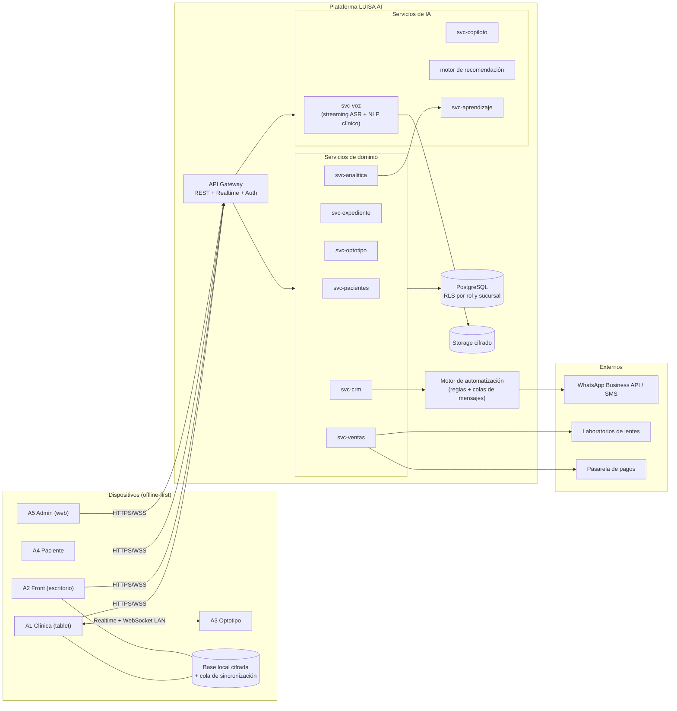
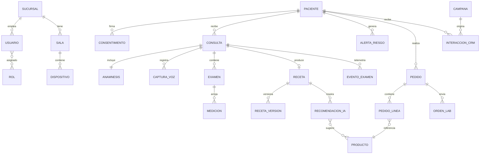

# 01 — ARQUITECTURA MAESTRA
## Ecosistema ÓPTICAS LUISA AI (Módulo 8 — diseño completo, sin código)

Este documento define la arquitectura de todo el ecosistema. Es el contrato técnico que todas las fases deben respetar. Aquí **no se escribe código**: se definen componentes, datos, flujos, pantallas, APIs, seguridad, permisos y roles.

---

## 1. Decisiones de arquitectura (y por qué)

| Decisión | Elección | Alternativa descartada | Razón |
|---|---|---|---|
| Framework de aplicaciones | **Flutter** (una sola base de código) | Nativo iOS + Android + Electron | Una app para tablet, escritorio (Windows/macOS), optotipo (Android TV) y móvil del paciente. Mantener 4 códigos distintos multiplica errores y costos. |
| Backend | **PostgreSQL + capa de servicios gestionada** (modelo Supabase: Auth, Realtime, Storage, funciones serverless) | Backend monolítico propio desde el día 1 | Tiempo-a-valor: Realtime nativo (tablet↔optotipo), Row-Level Security en la base (seguridad clínica declarativa), y migrable a infraestructura propia sin reescribir el modelo de datos. |
| Sincronización tablet ↔ optotipo | **Canal Realtime con respaldo LAN (WebSocket local)** | Solo nube | El consultorio no puede depender del internet: si la nube cae, el examen continúa por red local. La nube solo persiste. |
| IA de voz | **Reconocimiento de voz en streaming** (es-MX) con vocabulario clínico personalizado | Dictado genérico del teclado | El dictado genérico destroza términos como "queratometría", "esfera −2.25" o "add +1.75". Se usa un motor con *boosting* de léxico optométrico. |
| IA de lenguaje (resumen, copiloto, ventas) | **LLM vía API con plantillas estructuradas** (salida JSON validada) | Reglas fijas programadas | Las reglas fijas no resumen anamnesis libres ni detectan patrones de respuesta. El LLM produce salida estructurada que el sistema valida antes de guardar. |
| IA en dispositivo | **TensorFlow Lite + MediaPipe** para lo que exige tiempo real (rostro, pupilas, PD, futuro autorrefractómetro) | Enviar video a la nube | Latencia, privacidad y costo: el video del rostro del paciente nunca sale del dispositivo; solo salen mediciones. |
| Modo sin conexión | **Offline-first con cola de sincronización** en las apps clínicas | Requerir conexión permanente | Una óptica no puede parar por un corte de internet. Todo lo clínico se escribe localmente primero y se sincroniza con resolución de conflictos por versión. |

---

## 2. Componentes del ecosistema

### 2.1 Aplicaciones (frontend Flutter)

| # | Aplicación | Plataforma | Usuario | Rol en el sistema |
|---|---|---|---|---|
| A1 | **LUISA Clínica** | Tablet (Android/iPad) | Optometrista | App principal: expediente, examen, copiloto de refracción, control del optotipo, receta |
| A2 | **LUISA Front** | Escritorio (Windows/macOS) | Recepción y ventas | Check-in, agenda, cotizaciones, venta asistida, caja, CRM |
| A3 | **LUISA Optotipo** | Android TV / mini-PC + pantalla 4K | (sin usuario directo) | Renderiza optotipos; obedece 100% a la tablet; nunca se toca manualmente |
| A4 | **LUISA Paciente** | Móvil (Android/iOS) + web | Paciente | QR de identificación, citas, recetas, estado del pedido, probador virtual (Fase 8) |
| A5 | **LUISA Admin** | Web | Dueño / gerente | Tableros: ventas, productividad, alertas clínicas, desempeño por optometrista |

### 2.2 Servicios de plataforma (backend)

| Servicio | Responsabilidad |
|---|---|
| **svc-identidad** | Autenticación, sesiones, roles, permisos, dispositivos autorizados |
| **svc-pacientes** | Alta/búsqueda/deduplicación de pacientes, QR, consentimientos |
| **svc-expediente** | Consultas, anamnesis, exámenes, recetas, versionado clínico inmutable |
| **svc-voz** | Streaming de audio → texto, extracción de entidades clínicas, resumen |
| **svc-copiloto** | Estado del examen en vivo, análisis de respuestas, sugerencias, detección de inconsistencia/azar/fatiga (Fase 3) |
| **svc-optotipo** | Estado y comandos de cada pantalla de optotipo (canal Realtime) |
| **svc-ventas** | Catálogo, recomendación IA, cotizaciones, pedidos, laboratorio |
| **svc-crm** | Seguimiento, recordatorios, reactivación, campañas, WhatsApp/SMS/email |
| **svc-analitica** | Telemetría de exámenes, alertas de riesgo visual, tableros |
| **svc-aprendizaje** | Ingesta anónima de telemetría, reentrenamiento y evaluación de modelos (Fase 7) |

### 2.3 Hardware propio (fases futuras)

| Pieza | Fase | Descripción |
|---|---|---|
| Pantalla de optotipo calibrada | 2 | Pantalla 4K + Android TV; calibración de luminancia (85–320 cd/m²) y distancia; QR de emparejamiento con la sala |
| Adaptador de autorrefracción | 6 | Carcasa impresa en 3D para smartphone: anillo de LEDs IR (850 nm), filtro paso-IR y óptica auxiliar para fotorrefracción excéntrica. Análisis físico completo en el documento de Fase 6 |
| Sensores del foróptero | Futuro | Encoders/lector óptico para capturar automáticamente esfera/cilindro/eje del foróptero manual; elimina el último dictado del examen |

---

## 3. Arquitectura lógica



Puntos clave:

- **Offline-first:** A1 y A2 escriben primero en su base local cifrada; una cola sincroniza contra la nube. Conflictos se resuelven por número de versión del registro clínico (el expediente es *append-only*: nunca se sobrescribe, se versiona).
- **Doble canal para el optotipo:** comando por Realtime en nube; si no hay internet, la tablet descubre la pantalla por mDNS en la LAN y le habla por WebSocket directo. El examen jamás se detiene.
- **La IA nunca escribe directo en el expediente:** toda salida de IA entra como *borrador con nivel de confianza* que el optometrista confirma con un toque. (Principio 2: copiloto, no piloto.)

---

## 4. Modelo de datos (esquema conceptual)



### Entidades principales

| Entidad | Campos clave (conceptuales) | Notas de diseño |
|---|---|---|
| **PACIENTE** | id, teléfono (índice único de búsqueda), nombre, fecha de nacimiento, ocupación, hábitos digitales, código QR, foto opcional, sucursal de origen | El teléfono es la llave de búsqueda de 2 segundos. Deduplicación difusa por nombre+fecha nacimiento. |
| **CONSULTA** | id, paciente, optometrista, sala, inicio/fin, motivo, estado, resumen IA, resumen confirmado | Contenedor de todo lo que ocurre en una visita. |
| **ANAMNESIS** | consulta, síntomas, antecedentes personales/familiares, medicamentos, transcripción fuente, confianza IA, confirmada por | Se llena por voz; cada dato conserva el fragmento de audio/texto del que salió (trazabilidad). |
| **CAPTURA_VOZ** | consulta, archivo de audio, transcripción, entidades extraídas, latencia, modelo usado | El audio vive en Storage cifrado con retención configurable. |
| **EXAMEN** | consulta, tipo (AV, refracción, queratometría, tonometría, etc.), datos estructurados, dispositivo origen | Un tipo por registro; extensible sin migrar tablas (datos estructurados por tipo). |
| **MEDICION** | examen, ojo (OD/OI), parámetro (esfera, cilindro, eje, add, AV, PD…), valor, unidad, origen (manual/voz/dispositivo/IA) | El campo *origen* es central para el aprendizaje continuo y la auditoría. |
| **RECETA / RECETA_VERSION** | receta final firmada; cada modificación crea versión nueva con autor y timestamp | Inmutable. Lo firmado nunca se edita: se versiona. |
| **EVENTO_EXAMEN** | consulta, timestamp ms, tipo de evento (cambio de lente, respuesta paciente, cambio de optotipo, pausa…), payload | La materia prima del copiloto (Fase 3) y del aprendizaje (Fase 7). Alta frecuencia, particionada por fecha. |
| **ALERTA_RIESGO** | paciente, tipo (cambio miópico acelerado, sospecha queratocono, presión, edad/riesgo…), severidad, evidencia, estado | Generadas por svc-analitica; siempre revisadas por humano. |
| **PRODUCTO** | tipo (mica, tratamiento, armazón), material, características ópticas, rangos de graduación compatibles, precio, stock | Los rangos de compatibilidad permiten filtrar armazones/micas viables para una receta dada. |
| **RECOMENDACION_IA** | receta, contexto (edad, ocupación, hábitos, presupuesto), productos sugeridos con razones, aceptada/rechazada | El campo aceptada/rechazada entrena el motor de ventas. |
| **PEDIDO / ORDEN_LAB** | estado del ciclo completo: cotizado → pagado → en laboratorio → recibido → entregado → seguimiento | Cada transición dispara automatizaciones de CRM. |
| **INTERACCION_CRM** | paciente, canal (WhatsApp/SMS/email/llamada), plantilla, estado, respuesta | Historial completo de contacto; alimenta la frecuencia óptima de contacto por paciente. |
| **USUARIO / ROL / DISPOSITIVO** | usuarios con roles por sucursal; dispositivos registrados y emparejados por sala | Un optotipo solo obedece a tablets de su misma sala/sucursal. |

Reglas transversales del modelo:

1. **Append-only clínico:** nada clínico se borra ni sobrescribe; todo se versiona con autor, timestamp y origen.
2. **Origen del dato obligatorio:** cada medición declara si vino de voz, captura manual, dispositivo o IA, y con qué confianza.
3. **Particionamiento:** EVENTO_EXAMEN y CAPTURA_VOZ se particionan por mes (volumen alto, consulta por rango).
4. **RLS (Row-Level Security):** las políticas de acceso viven en la base de datos, no solo en la API (ver §7).

---

## 5. Flujo maestro del paciente (end-to-end)

```mermaid
sequenceDiagram
    autonumber
    participant P as Paciente
    participant F as A2 Front (recepción)
    participant C as A1 Clínica (optometrista)
    participant O as A3 Optotipo
    participant IA as Servicios IA
    participant CRM as CRM/Automatización

    P->>F: Llega (dice teléfono o muestra QR)
    F->>F: Búsqueda &lt; 2 s
    alt Paciente existe
        F->>C: Expediente abierto en tablet antes de que el paciente se siente
    else Paciente nuevo
        C->>IA: Alta por voz (la IA pregunta solo lo indispensable)
        IA-->>C: Expediente creado + resumen para confirmar
    end
    C->>O: Control total del optotipo desde la tablet
    C->>IA: Cada cambio de graduación y respuesta → telemetría
    IA-->>C: Copiloto: inconsistencia, azar, fatiga, "refina cilindro", "repite prueba"
    C->>C: Optometrista firma receta (IA la redacta, el humano decide)
    C->>F: Receta + recomendación de venta lista en mostrador
    F->>P: Venta asistida (lente, tratamientos, armazones compatibles)
    F->>CRM: Pedido creado
    CRM->>P: Avisos automáticos: "tu lente está listo", seguimiento a 7 días, recordatorio anual
```

Tiempo objetivo puerta-a-puerta: **≤ 25 minutos** (hoy típico: 45–60). Cero hojas de papel.

---

## 6. Catálogo de APIs (contratos, sin implementación)

Convención: REST versionado (`/v1`), JSON, errores con código de dominio; canales Realtime para lo vivo (examen, optotipo). Autenticación por token de sesión + registro de dispositivo.

| Dominio | Operaciones principales |
|---|---|
| **Identidad** | iniciar sesión, renovar sesión, registrar dispositivo, emparejar optotipo con sala |
| **Pacientes** | buscar por teléfono/QR/nombre, crear (con payload de voz procesado), actualizar datos de contacto, fusionar duplicados, generar QR, registrar consentimiento |
| **Expediente** | abrir consulta, guardar anamnesis (borrador IA → confirmación), registrar examen/medición, cerrar consulta, firmar receta, historial completo del paciente, comparativa entre consultas |
| **Voz** | abrir sesión de dictado (streaming), recibir transcripción parcial en vivo, extraer entidades clínicas, resumir consulta |
| **Optotipo** | listar pantallas de la sala, tomar control, comando (tipo de carta, tamaño/logMAR, prueba duocromo/astigmatismo/rojo-verde/contraste/balance binocular, aleatorizar letras), estado y confirmación de cada comando |
| **Copiloto** (Fase 3) | iniciar sesión de examen, empujar evento (cambio de lente, respuesta, tiempo), recibir sugerencias en vivo, generar borrador de receta |
| **Ventas** | recomendar productos para receta+perfil, cotizar, crear pedido, estado de orden de laboratorio, registrar aceptación/rechazo de recomendación |
| **CRM** | programar seguimiento, enviar plantilla (WhatsApp/SMS/email), pausar contacto (opt-out), métricas de campaña |
| **Analítica** | alertas de riesgo por paciente, tablero de sucursal, desempeño por optometrista, exportes |

Reglas de contrato:

- Toda salida de IA incluye `confianza` (0–1) y `evidencia` (de qué texto/evento salió).
- Toda escritura clínica exige `origen` y usuario responsable.
- Los comandos de optotipo son **idempotentes** y con confirmación explícita (la tablet muestra lo que la pantalla está mostrando realmente, no lo que ordenó).

---

## 7. Seguridad, permisos y roles

### 7.1 Principios

- **Cifrado:** TLS 1.3 en tránsito; cifrado en reposo en base y storage; base local de tablets cifrada (SQLCipher o equivalente).
- **El video/rostro nunca sale del dispositivo**; solo mediciones derivadas.
- **Auditoría total:** cada lectura y escritura de expediente queda registrada (quién, cuándo, desde qué dispositivo).
- **Cumplimiento:** diseño alineado a NOM-004-SSA3 (expediente clínico) y NOM-024-SSA3 (registros electrónicos) de México, y LFPDPPP para datos personales. El consentimiento informado es digital, firmado en pantalla, y bloquea el uso de datos para marketing si el paciente lo niega.
- **Retención configurable** del audio crudo (p. ej. 90 días) conservando la transcripción como dato clínico.

### 7.2 Matriz de roles y permisos

| Capacidad | Admin | Optometrista | Recepción | Ventas | Paciente |
|---|:-:|:-:|:-:|:-:|:-:|
| Buscar/crear paciente | ✅ | ✅ | ✅ | ✅ | — |
| Ver expediente clínico completo | ✅ | ✅ | ❌ | ❌ | Solo el suyo (resumen) |
| Editar/firmar receta | ❌ | ✅ | ❌ | ❌ | ❌ |
| Ver receta firmada | ✅ | ✅ | ✅ | ✅ | ✅ (la suya) |
| Controlar optotipo | ❌ | ✅ | ❌ | ❌ | ❌ |
| Cotizar/vender | ✅ | ❌ | ✅ | ✅ | — |
| Ver precios/costos y márgenes | ✅ | ❌ | Precios | Precios | Precios |
| CRM y campañas | ✅ | ❌ | ✅ | ✅ | — |
| Tableros y desempeño | ✅ | Solo el propio | ❌ | ❌ | — |
| Configurar sistema/roles | ✅ | ❌ | ❌ | ❌ | — |

Notas:
- El **Admin ve todo excepto editar clínica**: administrar no da derecho a firmar recetas.
- Recepción/Ventas ven **la receta, no el expediente**: la anamnesis y las notas clínicas son territorio del profesional de salud.
- Las políticas se implementan como **RLS en la base de datos** además de la API: un token robado de recepción no puede leer anamnesis ni con acceso directo a la base.

---

## 8. Inventario de pantallas por aplicación

*(El detalle visual de cada pantalla se especifica en el documento de su fase.)*

| App | Pantallas |
|---|---|
| **A1 Clínica** | Inicio de día · Búsqueda paciente (teléfono/QR) · Expediente (línea de tiempo) · Alta por voz · Consulta en vivo (anamnesis + exámenes) · Control de optotipo · Copiloto de refracción · Receta y firma · Comparativa histórica |
| **A2 Front** | Agenda del día · Check-in (QR/teléfono) · Cola de espera · Cotizador con recomendación IA · Catálogo/armazones compatibles · Caja y pagos · Estado de pedidos/laboratorio · Bandeja CRM |
| **A3 Optotipo** | Pantalla de reposo (branding + QR de emparejamiento) · Render de optotipos (Sloan/LogMAR, duocromo, reloj astigmático, rojo-verde, contraste, balance binocular) — *sin UI táctil: obedece a la tablet* |
| **A4 Paciente** | Mi QR · Mis recetas · Mis citas · Estado de mi pedido · Recordatorios · (Fase 8: probador virtual) |
| **A5 Admin** | Tablero general · Ventas y conversión · Alertas clínicas · Desempeño por optometrista · Configuración (sucursales, salas, dispositivos, usuarios, catálogo, plantillas CRM) |

---

## 9. Estrategia de IA (transversal)

| Capacidad | Dónde corre | Modelo/técnica | Fase |
|---|---|---|---|
| Voz → texto clínico | Nube (streaming) | ASR es-MX con léxico optométrico reforzado | 1 |
| Extracción de entidades clínicas | Nube | LLM con salida JSON validada contra esquema | 1 |
| Resumen de consulta | Nube | LLM con plantilla clínica | 1 |
| Detección de azar/inconsistencia/fatiga | Nube (tiempo casi real) | Modelo secuencial sobre EVENTO_EXAMEN (tiempos de respuesta, reversiones, curva psicométrica) | 3 |
| Sugerencias de refinamiento (cilindro/esfera/repetir) | Nube | Reglas clínicas + modelo entrenado con exámenes históricos | 3 |
| Recomendación de venta | Nube | Ranking sobre catálogo filtrado por compatibilidad óptica + perfil | 4 |
| Riesgo visual y alertas | Nube (batch nocturno + on-demand) | Series de tiempo por paciente (velocidad de cambio dióptrico por edad) | 5 |
| Pupilas/PD/rostro (y Fase 6) | **En dispositivo** | MediaPipe + TFLite | 6/8 |
| Aprendizaje continuo | Nube | Telemetría anónima → reentrenamiento evaluado contra exámenes firmados | 7 |

Regla de oro repetida a propósito: **ninguna salida de IA llega al paciente sin confirmación del profesional.**

---

## 10. Riesgos de nivel ecosistema

| # | Riesgo | Impacto | Mitigación |
|---|---|---|---|
| 1 | Dependencia de internet en consultorio | Examen detenido | Offline-first + WebSocket LAN para optotipo |
| 2 | ASR falla con acentos/ruido de mostrador | Datos clínicos erróneos | Confirmación visual obligatoria de cada entidad extraída; micrófono direccional; léxico reforzado |
| 3 | Percepción de "la IA me sustituye" por optometristas | Rechazo del sistema | Diseño copiloto: la IA ahorra trabajo (escribir, cambiar pantallas), nunca decide; métricas de desempeño privadas por defecto |
| 4 | Fuga de datos clínicos | Legal + reputacional | RLS en base, cifrado local, auditoría total, retención mínima de audio |
| 5 | Sobre-promesa del autorrefractómetro (Fase 6) | Credibilidad clínica | Mandato explícito: análisis físico primero, prototipo después, validación contra autorrefractómetro comercial antes de cualquier uso |
| 6 | Deriva de modelos con datos propios | Recetas sugeridas degradadas | Evaluación continua contra recetas firmadas; releases de modelo versionados y reversibles (estilo Tesla OTA) |
| 7 | Calibración del optotipo (distancia/luminancia) | AV mal medida | Asistente de calibración por sala con verificación periódica obligatoria |

---

## 11. Orden de construcción

La Fase 1 (Expediente Clínico Inteligente) construye los cimientos que todas las demás consumen: identidad, pacientes, consultas, voz→texto, resumen IA y el esqueleto de A1/A2. Ver [02 — Fase 1](./02-fase-1-expediente-clinico.md).
