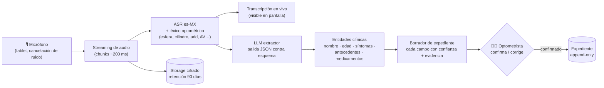
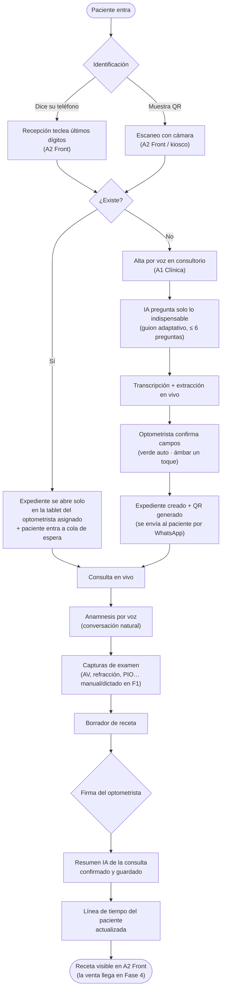
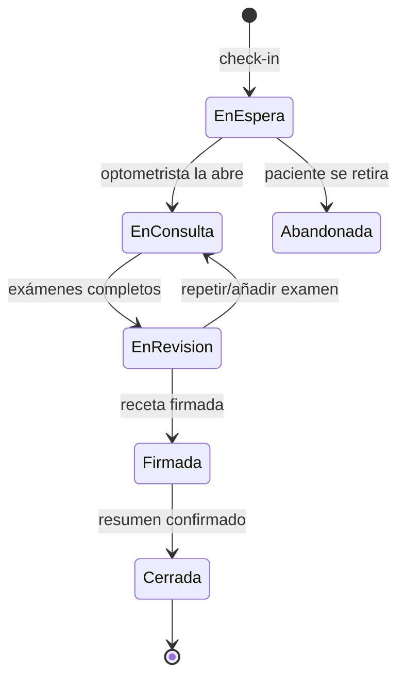

# 02 — FASE 1
## EXPEDIENTE CLÍNICO INTELIGENTE (Módulo 1)

> Cero papel. Cero escritura innecesaria. El paciente se identifica en segundos; si no existe, la IA lo da de alta por voz preguntando solo lo indispensable, transcribe todo, y entrega un resumen que el optometrista confirma con un toque.

Esta fase construye además los **cimientos** de todo el ecosistema: identidad, roles, pacientes, consultas, captura por voz y las apps A1 (Clínica) y A2 (Front) en su primera versión.

---

## 1. Objetivo

| Métrica | Hoy (proceso en papel) | Meta Fase 1 |
|---|---|---|
| Tiempo de alta de paciente nuevo | 5–10 min llenando formato | **≤ 90 segundos por voz** |
| Tiempo de localizar expediente existente | 1–5 min buscando físico | **≤ 2 segundos** (teléfono o QR) |
| Hojas de papel por consulta | 2–4 | **0** |
| Datos ilegibles o perdidos | Frecuente | **0** (todo digital, versionado, auditado) |
| Re-captura del mismo dato | 2–3 veces (formato → libreta → receta) | **1 sola captura en origen** |

Alcance funcional de la fase:

1. Búsqueda instantánea por **teléfono** (últimos dígitos bastan) o **QR**.
2. Alta de paciente nuevo **conducida por voz**: la IA hace solo las preguntas indispensables, en orden, y llena el expediente sola.
3. **Anamnesis por voz** dentro de la consulta: el optometrista conversa; el sistema transcribe, extrae entidades clínicas y las coloca en su campo.
4. **Resumen automático** de la consulta, con nivel de confianza y evidencia por dato, confirmado por el profesional.
5. Expediente como **línea de tiempo**: cada visita, receta y estudio en orden cronológico, comparable entre consultas.
6. Fundaciones: autenticación, roles (§7 de la Arquitectura Maestra), sucursales, salas, dispositivos, consentimiento digital y auditoría.

Fuera de alcance de esta fase (viven en fases posteriores): control de optotipo (F2), copiloto de refracción (F3), ventas (F4), CRM (F5), autorrefracción (F6).

---

## 2. Arquitectura

Componentes que se construyen en esta fase:

| Componente | Se construye | Detalle |
|---|---|---|
| **A1 Clínica (tablet)** | v1 | Búsqueda, alta por voz, expediente línea de tiempo, consulta con anamnesis por voz, captura manual de exámenes (la refracción aún se dicta/teclea; el copiloto llega en F3), receta y firma |
| **A2 Front (escritorio)** | v0.5 | Check-in por teléfono/QR, cola de espera del día, vista de receta firmada (sin ventas todavía) |
| **svc-identidad** | v1 | Sesiones, roles, RLS, registro de dispositivos |
| **svc-pacientes** | v1 | CRUD + búsqueda difusa + deduplicación + QR + consentimiento |
| **svc-expediente** | v1 | Consultas, anamnesis, mediciones, recetas versionadas, auditoría |
| **svc-voz** | v1 | Sesión de dictado streaming, transcripción en vivo, extracción de entidades, resumen |
| **Sincronización offline** | v1 | Base local cifrada + cola; el consultorio funciona sin internet |

Pipeline de voz (el corazón de la fase):

Decisiones de arquitectura específicas de la fase:

1. **La transcripción es visible en vivo** (estilo pizarra lateral). El profesional ve lo que el sistema entiende mientras habla; los errores se corrigen al momento, no al final.
2. **Confianza por campo, no por documento.** "Nombre: Juan Pérez (0.98)" se auto-acepta con marca verde; "medicamento: ¿metformina? (0.61)" se resalta en ámbar y exige toque de confirmación.
3. **La IA pregunta solo lo indispensable** en el alta: guion adaptativo de 6 preguntas base (nombre → fecha de nacimiento → teléfono ya viene del check-in → ocupación → motivo de visita → antecedentes relevantes al motivo). Si el paciente ya mencionó algo espontáneamente, la IA **no lo vuelve a preguntar**.
4. **Todo funciona sin internet excepto la voz.** Si no hay conexión, la app cae a formulario rápido optimizado (teclado) y encola el audio para transcribir al reconectar. El consultorio nunca se detiene.

---

## 3. Diagrama

Flujo completo de la Fase 1:

Máquina de estados de la consulta (contrato que respetarán todas las fases futuras):

---

## 4. Base de datos

Tablas que se crean en esta fase (subconjunto del modelo maestro, §4 del doc 01). Convención: todas llevan `id` UUID, `creado_en`, `creado_por`, `sucursal_id` y auditoría; lo clínico es append-only.

| Tabla | Campos principales | Índices / reglas |
|---|---|---|
| `sucursal` | nombre, dirección, zona horaria, activa | — |
| `sala` | sucursal, nombre, tipo (consultorio/mostrador) | — |
| `usuario` | nombre, correo, hash de acceso, activo | Único por correo |
| `usuario_rol` | usuario, rol (admin/optometrista/recepcion/ventas), sucursal | Un usuario puede tener roles distintos por sucursal |
| `dispositivo` | tipo (tablet/escritorio/optotipo), sala, huella del dispositivo, autorizado_por | Un dispositivo no autorizado no abre sesión |
| `paciente` | teléfono, nombre, apellidos, fecha_nacimiento, sexo, ocupación, hábitos (horas pantalla/día, conduce de noche, deporte), qr_token, notas_contacto | **Índice por teléfono (búsqueda por sufijo)**; índice trigram por nombre para búsqueda difusa; `qr_token` rotable |
| `consentimiento` | paciente, tipo (tratamiento de datos / marketing / uso de audio), otorgado, firma_digital, timestamp | Marketing denegado ⇒ CRM bloqueado para ese paciente (se aplica desde F5) |
| `consulta` | paciente, optometrista, sala, estado (máquina de estados §3), motivo, inicio, fin | Índice por paciente+fecha |
| `anamnesis` | consulta, síntomas[], antecedentes_personales[], antecedentes_familiares[], medicamentos[], alergias[], texto_libre | Cada elemento guarda: valor, confianza, evidencia (fragmento fuente), confirmado_por |
| `captura_voz` | consulta, ruta_audio, transcripcion, entidades_json, duracion, modelo, estado (pendiente/procesada/fallida) | Particionada por mes; audio con retención 90 días, transcripción permanente |
| `examen` | consulta, tipo (agudeza_visual/refraccion/queratometria/tonometria/lensometria/otro), datos_json validados por esquema del tipo | — |
| `medicion` | examen, ojo (OD/OI/AO), parametro (esfera/cilindro/eje/add/av/pio/pd…), valor, unidad, **origen** (manual/voz/dispositivo/ia), confianza | El `origen` es obligatorio: es la base de la auditoría y del aprendizaje (F7) |
| `receta` | consulta, estado (borrador/firmada/anulada), firmada_por, firmada_en | Firmada ⇒ inmutable |
| `receta_version` | receta, número, contenido completo (OD/OI: esfera, cilindro, eje, add, PD, prisma, AV lograda), motivo_de_cambio, autor | Toda edición posterior a la firma crea versión nueva |
| `auditoria` | usuario, dispositivo, acción (leer/crear/versionar), entidad, entidad_id, timestamp | Append-only; incluye lecturas de expediente |

Políticas RLS activas desde esta fase:

1. `paciente`, `consulta`, `receta`: visibles solo para usuarios con rol en la sucursal del registro.
2. `anamnesis`, `captura_voz`, `medicion`: solo roles **optometrista** y **admin** (admin sin escritura clínica).
3. `receta` firmada: legible por recepción/ventas (para F4) pero jamás editable.
4. Toda escritura clínica exige rol optometrista **y** dispositivo autorizado.

---

## 5. Pantallas

### A1 Clínica (tablet del optometrista)

| # | Pantalla | Diseño (¿cómo lo haría Apple?) |
|---|---|---|
| 1 | **Inicio de día** | Cola de espera en tarjetas: foto/iniciales, motivo, tiempo esperando. Un toque abre la consulta. Sin menús. |
| 2 | **Búsqueda** | Un solo campo gigante: acepta dígitos de teléfono o nombre; resultados mientras se escribe; botón de cámara para QR. |
| 3 | **Alta por voz** | Pantalla dividida: izquierda, la pregunta actual en texto grande (la IA la lee en voz alta); derecha, los campos llenándose en vivo con su color de confianza (verde/ámbar). Barra de progreso de las ≤ 6 preguntas. Botón "modo teclado" siempre visible (fallback). |
| 4 | **Expediente — línea de tiempo** | Scroll vertical cronológico: cada visita es una tarjeta (fecha, motivo, receta resumida, delta de graduación vs anterior con flechas ↑↓). Encabezado fijo: nombre, edad, ocupación, alertas. |
| 5 | **Consulta en vivo** | Tres zonas: (a) pizarra de transcripción en vivo, (b) anamnesis estructurándose sola, (c) accesos a capturas de examen. El micrófono se pausa con un toque (privacidad). |
| 6 | **Captura de examen** | Teclado optométrico propio: rueda de esfera (pasos 0.25), cilindro, eje (dial), AV (lista logMAR). Cero teclado QWERTY para números clínicos. |
| 7 | **Receta y firma** | Borrador completo pre-llenado; comparativa contra receta anterior lado a lado; firma con trazo en pantalla; al firmar se genera el resumen IA para confirmación final. |

### A2 Front (escritorio recepción)

| # | Pantalla | Diseño |
|---|---|---|
| 1 | **Check-in** | Campo único teléfono/QR + cámara. Resultado en < 2 s: tarjeta del paciente con botón "a cola de espera". Si no existe: "pasa a consultorio, el alta es por voz" (recepción **no** captura datos: se capturan una sola vez, en origen). |
| 2 | **Cola del día** | Columnas: en espera → en consulta → receta lista. Se mueve sola (estado de la consulta en tiempo real). |
| 3 | **Receta firmada** | Vista de solo lectura para imprimir/enviar por WhatsApp si el paciente la pide. (El cotizador llega en F4.) |

Lineamientos UX transversales: tipografía grande (se usa a un brazo de distancia), modo oscuro para sala de refracción, latencia percibida < 100 ms en cada toque (optimistic UI sobre la base local), y **ninguna pantalla exige más de 2 toques para la acción principal**.

---

## 6. Flujo

Flujo detallado del alta por voz (el momento crítico de la fase):

1. Optometrista toca **"Paciente nuevo"** → se abre sesión de dictado.
2. La IA saluda y pregunta el **nombre completo** (audio + texto en pantalla).
3. El paciente responde de forma natural ("soy Juan Pérez García, tengo 42 años…"). La IA **extrae todo lo que venga** — si el paciente ya dijo la edad, la pregunta de fecha de nacimiento se ajusta ("¿me confirma su fecha de nacimiento?") o se omite si ya es deducible con confianza alta.
4. Guion adaptativo restante: ocupación → hábitos visuales relevantes (horas de pantalla, manejo nocturno) → motivo de la visita → antecedentes ligados al motivo (la IA **no** interroga antecedentes irrelevantes: indispensable significa indispensable).
5. Cada respuesta puebla campos en vivo con confianza por campo.
6. El optometrista corrige lo ámbar (toque → microteclado o re-dictado del campo).
7. Confirmación final → expediente creado, QR generado, y si hay consentimiento, enviado al WhatsApp del paciente.
8. La consulta continúa sin transición: la misma sesión de voz pasa a modo anamnesis.

Manejo de errores del flujo:

| Situación | Comportamiento |
|---|---|
| Sin internet | Modo teclado optimizado + audio encolado para transcripción diferida |
| Ruido / ASR con confianza baja sostenida | La IA lo dice ("no le escuché bien") y la app sugiere modo teclado para ese campo |
| Teléfono ya registrado a otro nombre | Flujo de posible duplicado: mostrar coincidencia, ofrecer fusionar o crear con teléfono secundario |
| Paciente rechaza grabación de audio | Consentimiento de audio denegado ⇒ transcripción en vivo sin persistir audio crudo |
| Menor de edad | La IA pide los datos al tutor; el expediente marca tutor responsable y su teléfono |

---

## 7. Riesgos

| # | Riesgo | Prob. | Impacto | Mitigación |
|---|---|:-:|:-:|---|
| 1 | ASR falla con acentos, adultos mayores o ruido | Alta | Alto | Léxico clínico reforzado; confirmación por campo; micrófono direccional en tablet; fallback a teclado siempre a un toque |
| 2 | El LLM extractor "alucina" un dato clínico | Media | **Crítico** | Salida JSON validada contra esquema; toda entidad exige evidencia textual literal de la transcripción — sin evidencia, el campo queda vacío, nunca inventado; umbral de confianza para auto-aceptar |
| 3 | Resistencia del personal al cambio de flujo | Media | Alto | El sistema ahorra trabajo visible desde el día 1 (no escribir); capacitación de 1 día; modo híbrido papel→digital solo durante las 2 semanas de transición |
| 4 | Pacientes incómodos con la grabación | Media | Medio | Consentimiento explícito, pausa de micrófono visible, retención de audio 90 días, opción de solo-transcripción |
| 5 | Corte de internet en horas pico | Media | Alto | Offline-first: todo el flujo (menos ASR) funciona local; sincronización automática al volver |
| 6 | Duplicados de pacientes ensucian la base | Alta | Medio | Búsqueda difusa previa al alta + detector de duplicados (teléfono, nombre+fecha) + herramienta de fusión con auditoría |
| 7 | Incumplimiento normativo (NOM-004/024, LFPDPPP) | Baja | Crítico | Revisión legal del diseño antes de producción; consentimientos digitales; auditoría total; cifrado extremo a extremo |
| 8 | Costo por consulta de ASR+LLM se dispara | Media | Medio | Streaming solo durante dictado activo (detección de voz); resumen una vez por consulta; monitoreo de costo por consulta con presupuesto tope |

---

## 8. Mejoras

Mejoras planeadas dentro de la propia fase (v1.x, sin esperar fases futuras):

1. **Identificación por rostro opcional** (opt-in): el paciente frecuente es reconocido al entrar (MediaPipe en dispositivo, embedding local, jamás en nube).
2. **Diarización de voz**: separar automáticamente quién habla (optometrista vs paciente) para anamnesis más limpia.
3. **Resumen comparativo automático**: al abrir un expediente existente, la IA narra en 3 líneas qué cambió desde la última visita.
4. **Alta desde la sala de espera**: el paciente nuevo escanea un QR y responde las preguntas de la IA desde su propio teléfono mientras espera; al sentarse, todo está listo.
5. **Importación del archivo muerto**: fotografiar expedientes de papel históricos → OCR + extracción IA → expediente digital retroactivo (proyecto de migración con validación humana).
6. **Voz del asistente con personalidad de marca** (TTS natural es-MX) para que el alta se sienta conversación, no interrogatorio.

Lo que esta fase deja listo para las siguientes: la máquina de estados de consulta (F2/F3 la extienden), `medicion.origen` (F7 lo explota), consentimientos (F5 los respeta), y el canal Realtime de la consulta (F2 lo usa para el optotipo).

---

## 9. Tecnologías

| Capa | Tecnología | Justificación |
|---|---|---|
| Apps A1/A2 | **Flutter** (Dart) | Una base de código para tablet, escritorio y futuro optotipo/paciente; rendimiento nativo; teclados optométricos custom |
| Base local | **SQLite cifrado (SQLCipher) + Drift** | Offline-first con tipado fuerte y migraciones |
| Backend | **PostgreSQL gestionado con Auth + RLS + Realtime + Storage** (modelo Supabase) | RLS = seguridad clínica declarativa en la base; Realtime listo para F2; storage cifrado para audio |
| ASR | Motor de streaming **es-MX** con *phrase boosting* de léxico optométrico | Precisión en términos clínicos y números dióptricos; transcripción parcial < 300 ms |
| Extracción/resumen | **LLM vía API** (Claude) con salida estructurada validada contra esquema | Extracción de entidades con evidencia obligatoria y confianza por campo |
| Detección de voz | **VAD en dispositivo** | El audio solo se transmite cuando alguien habla: privacidad y costo |
| QR | Generación firmada (token rotable) + escaneo con cámara | El QR no contiene datos personales, solo un token opaco |
| Mensajería (envío de QR/receta) | **WhatsApp Business API** | Canal dominante en México; base para F5 |
| Observabilidad | Trazas + métricas por consulta (latencia ASR, confianza media, correcciones humanas por campo) | Las correcciones humanas son el dataset de mejora continua (semilla de F7) |
| Seguridad | TLS 1.3, cifrado en reposo, RLS, auditoría append-only, dispositivos registrados | §7 de la Arquitectura Maestra |

---

## Criterio de salida de la Fase 1 (definition of done)

La fase se considera **cerrada** — y solo entonces se abre la Fase 2 — cuando:

- [ ] Un paciente nuevo queda dado de alta por voz en ≤ 90 s en condiciones reales de consultorio.
- [ ] Búsqueda por teléfono/QR responde en ≤ 2 s con la base completa migrada.
- [ ] Precisión de extracción de entidades ≥ 95 % en piloto (medida contra corrección humana).
- [ ] Una consulta completa (alta → anamnesis → examen → receta firmada → resumen) ocurre sin tocar papel ni teclado QWERTY.
- [ ] El flujo completo funciona sin internet (excepto voz, con su fallback) y sincroniza sin pérdida.
- [ ] Auditoría y RLS verificadas con pruebas de penetración básicas de roles.
- [ ] Piloto de 2 semanas en sucursal real con ≥ 50 consultas y satisfacción del optometrista ≥ 8/10.

**Siguiente paso tras aprobar este diseño:** escribir el código de la Fase 1. Después — y solo después — se redactará el diseño de la **Fase 2: Optotipo Digital Controlado**.
