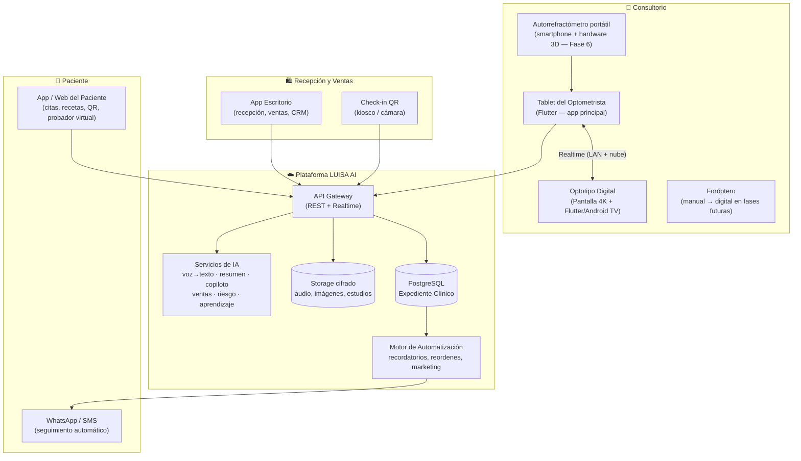

# PROYECTO TITÁN — ÓPTICAS LUISA AI

> **La óptica más tecnológica del mundo.**
> Un ecosistema completo de software, inteligencia artificial, visión computacional y hardware propio, diseñado para eliminar el papel, eliminar errores humanos, reducir tiempos, aumentar ventas y hacer que el optometrista trabaje con un copiloto de IA.

---

## Filosofía de diseño

Antes de diseñar cada módulo nos hicimos cuatro preguntas:

| Pregunta | Lo que nos exige |
|---|---|
| ¿Cómo lo haría **Apple**? | Cero fricción. El usuario nunca configura nada. Todo funciona al primer toque. |
| ¿Cómo lo haría **Tesla**? | El sistema aprende de cada uso. Mejora solo, con actualizaciones remotas. |
| ¿Cómo lo haría **Zeiss**? | Precisión clínica absoluta. Nada sale al paciente sin validación profesional. |
| ¿Cómo lo haría **Topcon**? | Los instrumentos hablan entre sí. El dato se captura una sola vez, en el origen. |

De ahí salen los **cinco principios inviolables** del ecosistema:

1. **Cero papel, cero re-captura.** Todo dato se captura automáticamente en su origen (voz, sensor, foróptero, optotipo) y fluye solo.
2. **La IA es copiloto, nunca piloto.** El optometrista firma; la IA sugiere, ordena, resume y alerta.
3. **El paciente nunca espera.** Identificación en segundos (teléfono o QR), expediente abierto antes de sentarse.
4. **Cada examen entrena al sistema.** Telemetría anónima de cada consulta alimenta el aprendizaje continuo.
5. **Grado clínico o nada.** Cifrado, trazabilidad, roles y cumplimiento normativo desde el día uno, no como parche.

---

## Mapa del ecosistema

---

## Documentos del proyecto

| Documento | Contenido | Estado |
|---|---|---|
| [01 — Arquitectura Maestra](./01-arquitectura-maestra.md) | Arquitectura completa, base de datos, APIs, seguridad, roles, pantallas (Módulo 8 — sin código) | ✅ Completo |
| [02 — Fase 1: Expediente Clínico Inteligente](./02-fase-1-expediente-clinico.md) | Diseño completo de la Fase 1: objetivo, arquitectura, diagramas, BD, pantallas, flujo, riesgos, mejoras, tecnologías | ✅ Completo — lista para aprobación |
| Fase 2 en adelante | Se redactan **una por una**, solo al cerrar la fase anterior | ⏳ Pendiente |

---

## Roadmap por fases

Regla de oro: **nunca se avanza a una fase sin cerrar completamente la anterior.**

| Fase | Nombre | Módulos que cubre | Entregable clave |
|---|---|---|---|
| **1** | Expediente Clínico Inteligente | Módulo 1 | Alta y búsqueda de pacientes sin papel, expediente por voz, resumen IA |
| **2** | Optotipo Digital Controlado | Módulo 3 | Pantalla de optotipo 100% controlada desde la tablet (letras, tamaños, duocromo, astigmatismo, contraste, balance binocular) |
| **3** | Asistente de Refracción (Copiloto IA) | Módulos 2 y 5 | Registro de cada cambio de graduación y respuesta; detección de inconsistencia, azar y fatiga; receta automática |
| **4** | Inteligencia de Ventas | Módulo 6 | Recomendación automática de lente, material, tratamientos y armazones según edad, ocupación, graduación, hábitos y presupuesto |
| **5** | CRM + Automatización + Marketing | Módulos 5 y 6 | Seguimiento automático, recordatorios, reactivación, campañas inteligentes |
| **6** | Autorrefracción asistida por IA | Módulo 4 | Estudio científico de fotorrefracción excéntrica con smartphone; diseño del hardware impreso en 3D (IR + óptica auxiliar); prototipos |
| **7** | Aprendizaje Continuo | Módulo 7 | Telemetría de cada examen, perfiles de desempeño por optometrista, mejora automática de modelos |
| **8** | Ecosistema Paciente | Transversal | App del paciente, probador virtual, expediente portátil con QR |

> **Nota sobre la Fase 6 (autorrefractómetro):** el mandato es *no asumir que es posible*. La ciencia de base existe — la **fotorrefracción excéntrica** (Howland & Howland, 1974) es el principio detrás de dispositivos comerciales como GoCheck Kids y 2WIN de Adaptica, y requiere iluminación infrarroja controlada que la cámara del teléfono **no** trae de fábrica. Por eso el roadmap ya contempla hardware auxiliar impreso en 3D (anillo de LEDs IR + filtro + lente). El análisis físico completo, con óptica de Purkinje, pupilometría y límites de precisión dióptrica, se desarrollará **exclusivamente** en el documento de la Fase 6.

---

## Estructura de fases

Cada documento de fase contiene obligatoriamente estas nueve secciones:

1. **Objetivo**
2. **Arquitectura**
3. **Diagrama**
4. **Base de datos**
5. **Pantallas**
6. **Flujo**
7. **Riesgos**
8. **Mejoras**
9. **Tecnologías**

Solo después de aprobar el diseño de una fase se escribe su código.
